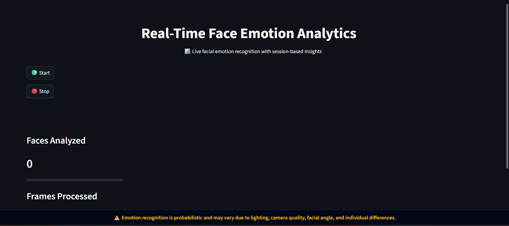
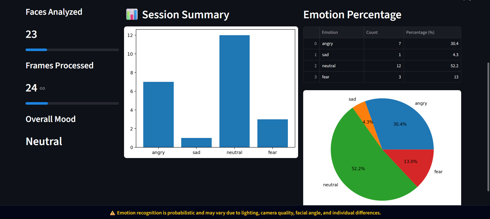

# 🎭 Real-Time Emotion Analytics Dashboard

> "The face is a window to the emotions within." 😊

> A real-time facial emotion recognition system with an industry-inspired analytics dashboard.

This project detects human emotions from a live webcam feed using deep learning and visualizes session-based emotion insights through a clean, professional dashboard UI.

The focus of this project is not only **emotion detection**, but also **how AI outputs are presented in a usable, analytics-driven interface**, similar to internal tools used in real-world applications.

---

## 📸 Preview

### Dashboard Interface


---

### Session Analytics

> Real-time emotion distribution with bar chart, 
> pie chart and session summary

---

## 🎯 Research Motivation
Emotion recognition in real-time systems presents key 
research challenges around:
- Temporal stability of predictions across frames
- Interpretable AI output for non-technical users
- Bridging deep learning inference with analytics systems
This project explores how computer vision models can be 
deployed in practical, user-facing applications — directly 
relevant to Healthcare AI and Human-Computer Interaction research.

---

## 📌 Project Overview

The **Real-Time Emotion Analytics Dashboard** captures live video frames, analyzes facial expressions using a deep learning model, and displays meaningful analytics such as:

- Number of faces analyzed
- Frames processed
- Overall (dominant) emotion
- Emotion distribution during a session

This project demonstrates:
- Practical use of computer vision
- Integration of deep learning models
- Real-time data processing
- Thoughtful UI/UX design for analytics dashboards

---

## ✨ Key Features

- 🎥 Live webcam-based emotion detection  
- 🧠 Deep learning emotion recognition (DeepFace)  
- 📊 Real-time analytics dashboard  
- 📈 Session-based emotion statistics  
- 🟢 Start / 🔴 Stop detection controls  
- 🧩 Temporal smoothing to reduce prediction flickering  
- 🖥️ Clean, industry-inspired dashboard UI  

---

## 🛠️ Tech Stack

- **Language:** Python  
- **Computer Vision:** OpenCV  
- **Deep Learning:** TensorFlow, DeepFace  
- **Web Framework:** Streamlit  
- **Data Processing:** Pandas  
- **Visualization:** Matplotlib  
- **UI Styling:** Custom CSS (Streamlit)  

---

## 🧠 System Architecture (High-Level)

1. Webcam captures live video frames  
2. Faces are detected using DeepFace’s internal face detection pipeline  
3. Each detected face is passed to a deep learning emotion model  
4. Emotion predictions are stabilized using recent frame history  
5. Emotion counts are collected during the session  
6. Dashboard updates metrics and charts in real time  

---

## 🧠 Model Details

This project uses **pre-trained Convolutional Neural Networks (CNNs)** provided by the **DeepFace** framework for emotion recognition.

Rather than training a CNN from scratch, the focus of this project is on:
- Integrating a deep learning model into a real-time system  
- Managing inference, session state, and analytics  
- Presenting AI outputs through an interpretable dashboard  

This mirrors real-world industry scenarios where engineers often work with<br>
pre-trained models and focus on **system design, deployment, and user-facing analytics**.

---

## 📊 Dashboard Components

- **Control Panel**
  - Start / Stop emotion detection

- **Metrics Section**
  - Faces Analyzed
  - Frames Processed
  - Overall Mood

- **Live Video Feed**
  - Real-time annotated webcam view (local execution)

- **Analytics Charts**
  - Emotion distribution (bar chart)
  - Emotion percentages (table & pie chart)

- **Session Summary**
  - Post-session emotion insights after stopping detection

---

## ⚠️ Limitations

> Emotion recognition is probabilistic and not perfectly accurate.

- Performance depends on:
  - Lighting conditions
  - Camera quality
  - Face angle and occlusions
- Requires webcam access (local execution)
- Not optimized for large-scale or multi-camera deployment

---

## 🚀 How to Run the Project

### 1️⃣ Clone the Repository
```bash
git clone <your-repository-url>
cd Face_Expression_detection
```

### 2️⃣ Create and Activate Virtual Environment
```bash
python -m venv venv
venv\Scripts\activate
```

### 3️⃣ Install Dependencies
```bash
pip install -r requirements.txt
```

### 4️⃣ Run the Application
```bash
python -m streamlit run app.py
``` 

---

## 🌐 Deployment Note

Due to browser and hosting restrictions, live webcam access via OpenCV is supported only in local environments.

The deployed Streamlit version focuses on demonstrating the dashboard UI, analytics flow, and session-based emotion insights.

📁 Project Structure
```bash
Face_Expression_detection/
│
├── app.py               # Main Streamlit dashboard application
├── main.py              # Initial experimentation script
├── requirements.txt     # Project dependencies
├── README.md            # Project documentation
└── venv/                # Virtual environment (local)
```

---

## 📌 Future Enhancements

- Emotion trend analysis over time
- Confidence threshold tuning
- Export session analytics as CSV
- Multi-face comparative analytics

---

## 👩‍💻 Author

Deveshree<br>
Final Year AIML Student<br>
Focused on building practical AI systems with real-world usability.<br>

---

⭐ If you find this project useful, feel free to star the repository!
